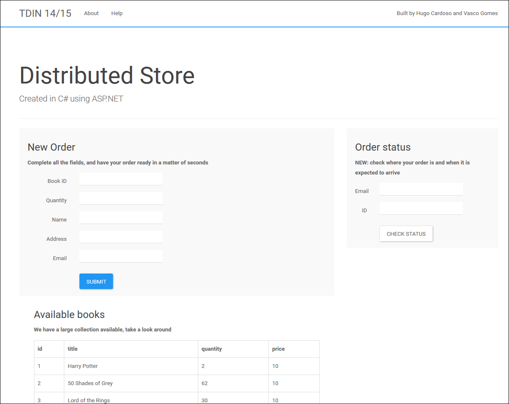
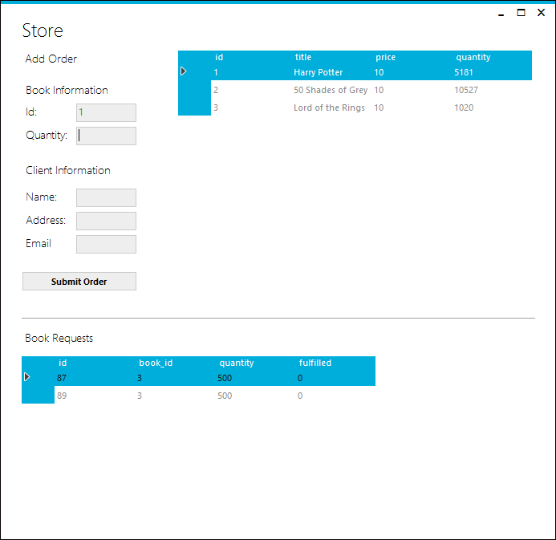
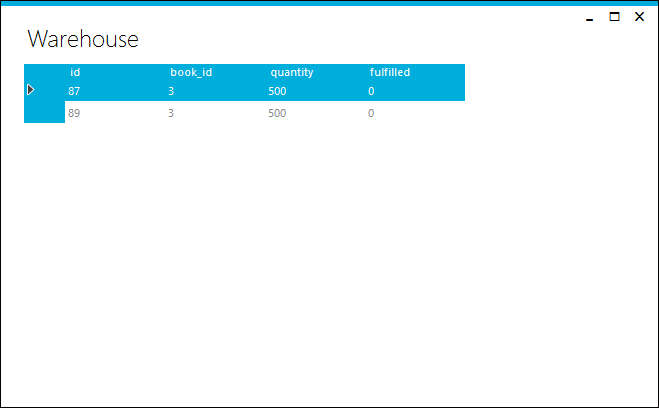

# Distributed Store

Developed for the class of Distribution and Integration Technologies (EIC0077) at MIEIC, FEUP. 

> A book editor prints and sells book titles and intends to develop a system for coordinating its orders and stock management. The editor owns two facilities: the store, with a public and exposition area, and a warehouse for storing larger quantities of books. The editor also intends to make available a web application for remote ordering.

> The application here presented was written in C#, using the Windows Communication Foundation (WCF) framework, and follows the service-oriented architecture (SOA) principles. Four different modules, or projects, were implemented: [1] store server; [2] store service; [3] store application; [4] warehouse application.

Further info can be found in the [full report](Docs/report.pdf) (Portuguese).

## Screenshots

Web application.

Store management application (internal use only).

Warehouse monitoring application.

## Usage Instructions

The server module (*StoreServer.exe*) should be initiated before any other modules. Afterwards, users may open multiple instances of the store (*StoreApp,exe*) and/or Warehouse (*Warehouse.exe*) applications.

Details regarding each individual application are available in the [full report](Docs/report.pdf) (Portuguese).
